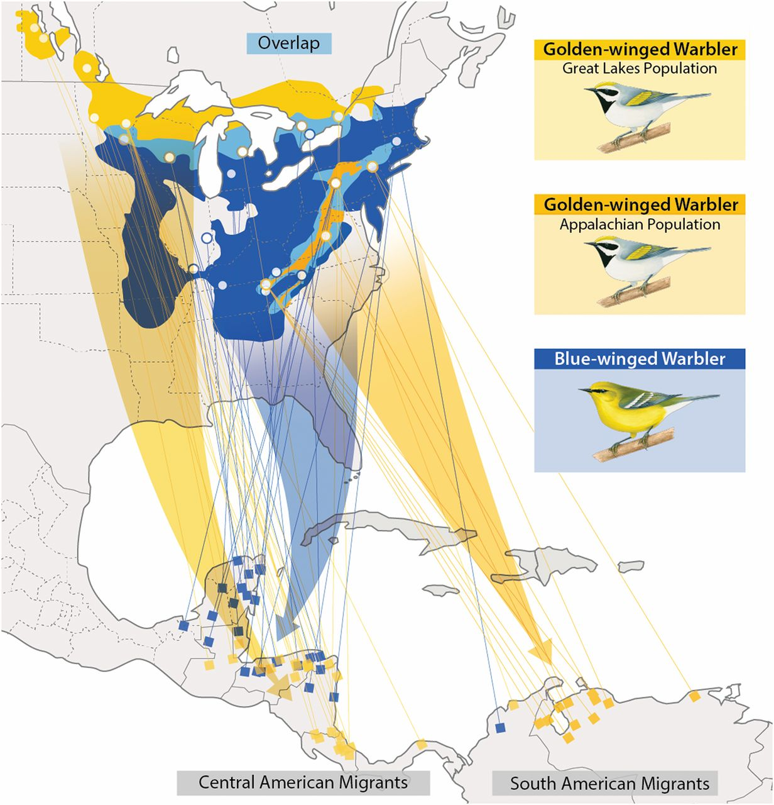

Currently my research focuses on finding better ways to model the evolution of hard-to-encode traits. 

## What is a hard-to-encode trait?

When comparative biologists want to model the evolution of phenotypic traits across a phylogeny, they have to make some decisions about how to describe and quantify that trait. This is called [character construction]() and it usually is pretty arbitrary, based on whatever the researcher is interested in, which can ocassionally cause problems. Let's use avian migration as an example trait since birds are cool (no citation needed). 

You probably know that some bird species migrate huge distances every year like clockwork. Warblers, for instance, leave Northern North America in the fall to spend te winter in Central & South America, then predictably return each spring.

These birds are considered an example of  a 'regular' or 'obligate' migrant. The conditions which tell them when to leave (known as [phenology]()), the path which they travel and where they go to are all pretty much the same year to year, within a population. Now people that *really* study birds may disagree with this, which is exactly why migration is such a difficult character/trait to encode.

* more migration 

## Wait, so what's evolving?

Okay so that seems like a lot of different ways to migrate! For someone who is interested in the evolution of traits, this can get messy fast. We can break migration down into Non-migratory (NM) and Migratory (M) ...but then are nomads in M or NM? We can keep them all separate, but that then complicates the trait 'space' -- the relationships and ontology of these traits. In other words, do we know the evolutionary relationship between these groups well enough to split them into groups that we would **expect** to evolve? Can a bird species evolve into a nomadic migration from being a resident, or does it need to be a migrant first? Maybe we can just run some sort of algorithm to classify them for us ... ([I tried this]())

## when 
